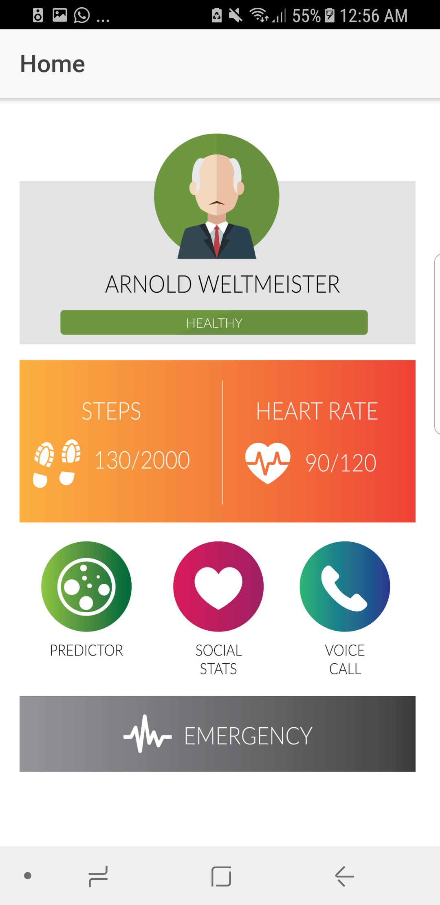
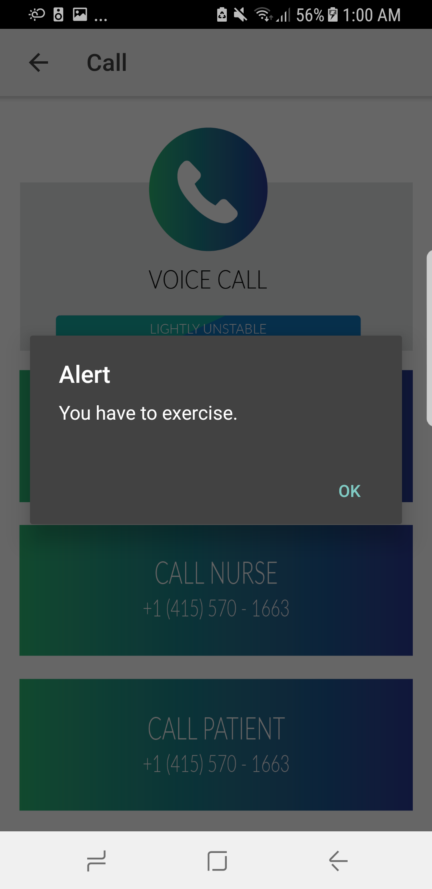
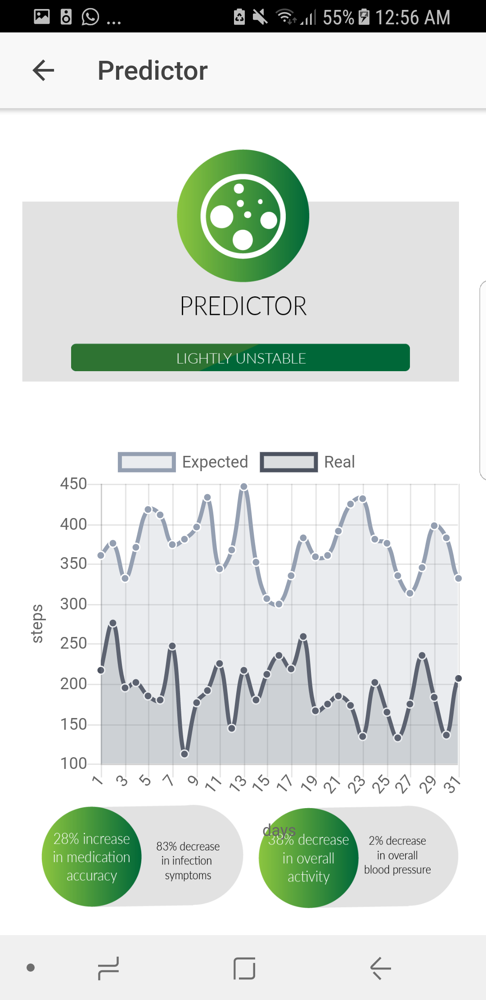
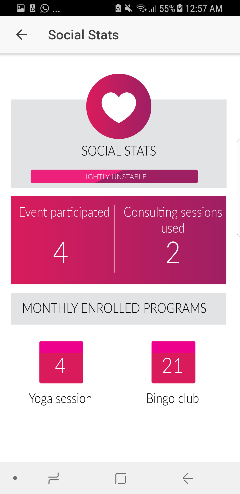
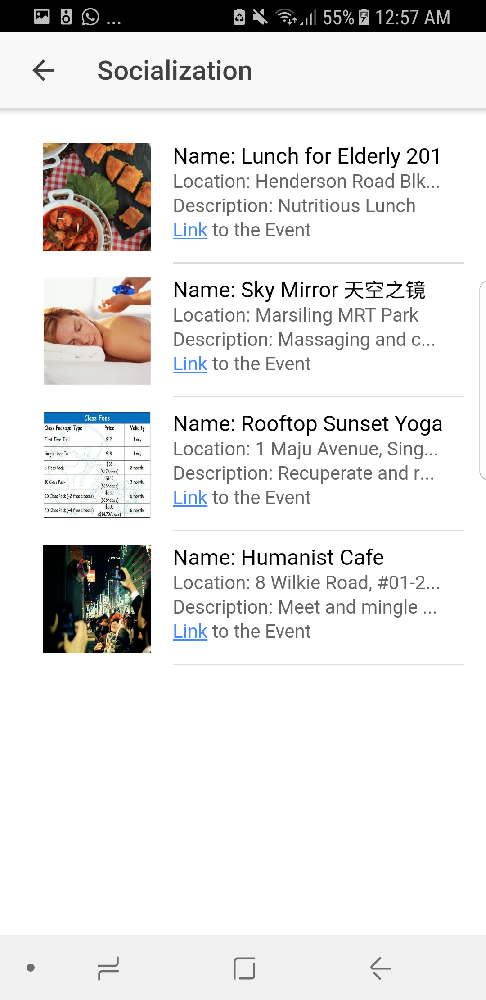
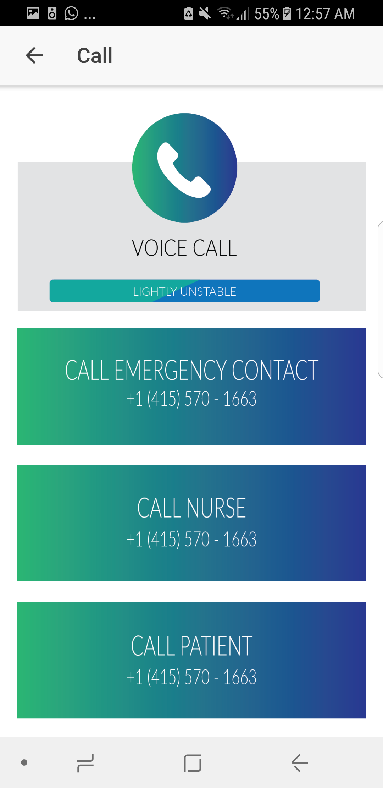

# ISO

## Summary
This hybrid mobile app built by Ionic was created in NCSV Innovate Hackathon 2017. It won the Grand Prize and all three sponsor prizes by Singtel, Nexosis and Back4App, Inc - Parse Server Made Simple.

The mobile app serves the purpose of taking care of the physical and mental wellbeing of the senior citizens. 

The three primary functions of the app:
1. **The app alerts the elderly to exercise.** It uses anomaly detection algorithm to identify the movement of the phone or wearable device wore on the senior citizen, and when the device is not moving during the time it should be, it will show the alert. It also tracks and shows the long-term exercising habit of the elderly.

2. **The app tracks how social the elderly user is, and suggests to the user nearby social activities that cater for the senior citizens.**

3. **The app allows one-button emergency call service**, so the elderly user can immediately call for help when accidents happen.
